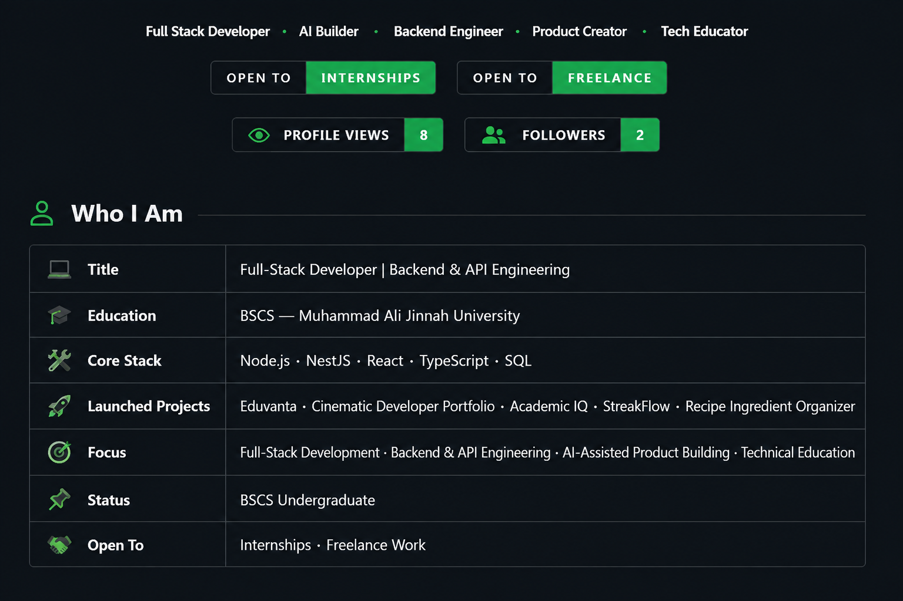
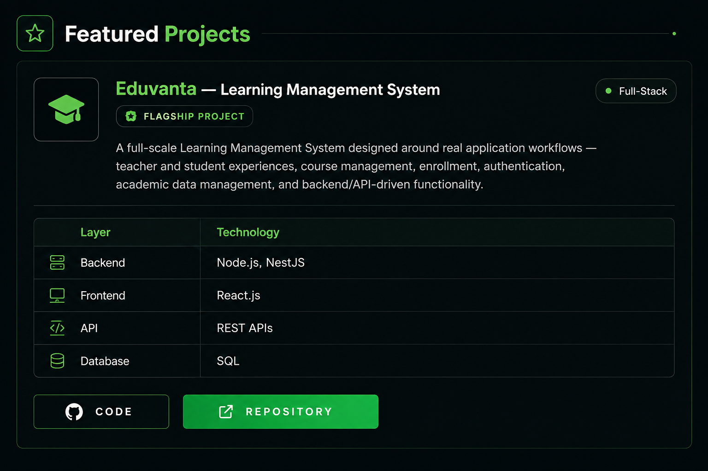
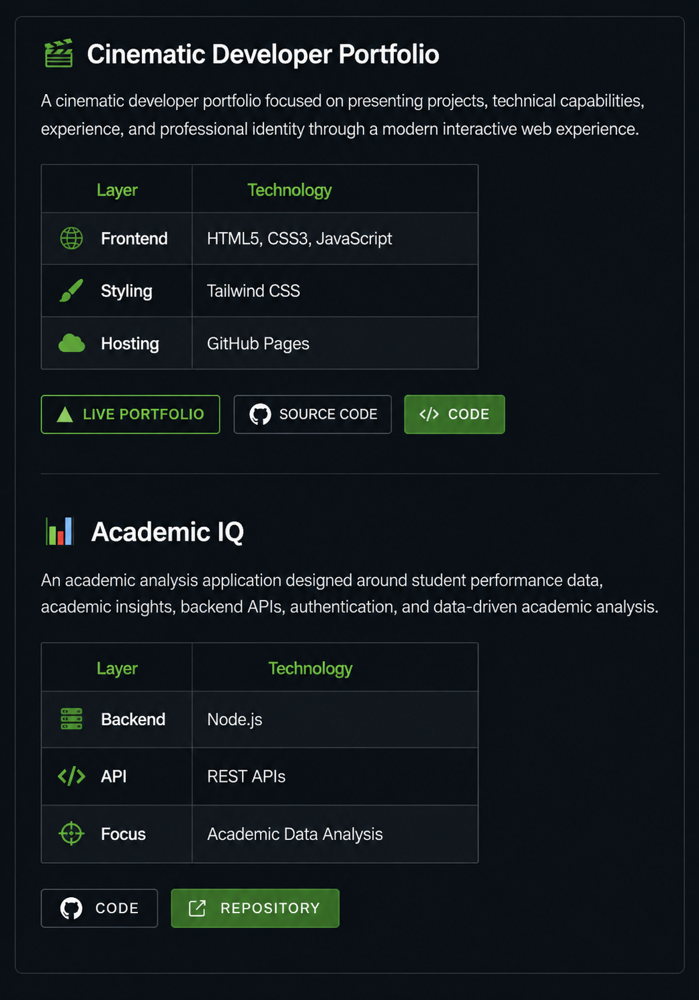
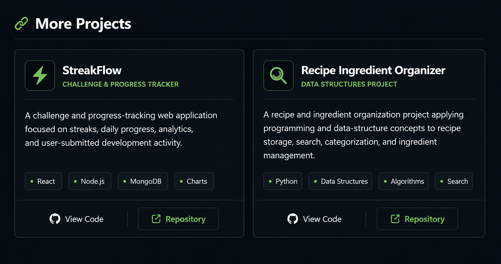
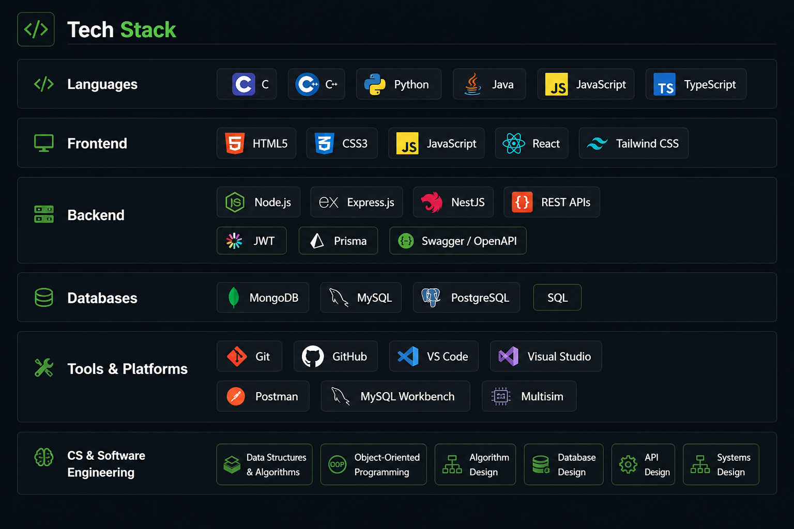
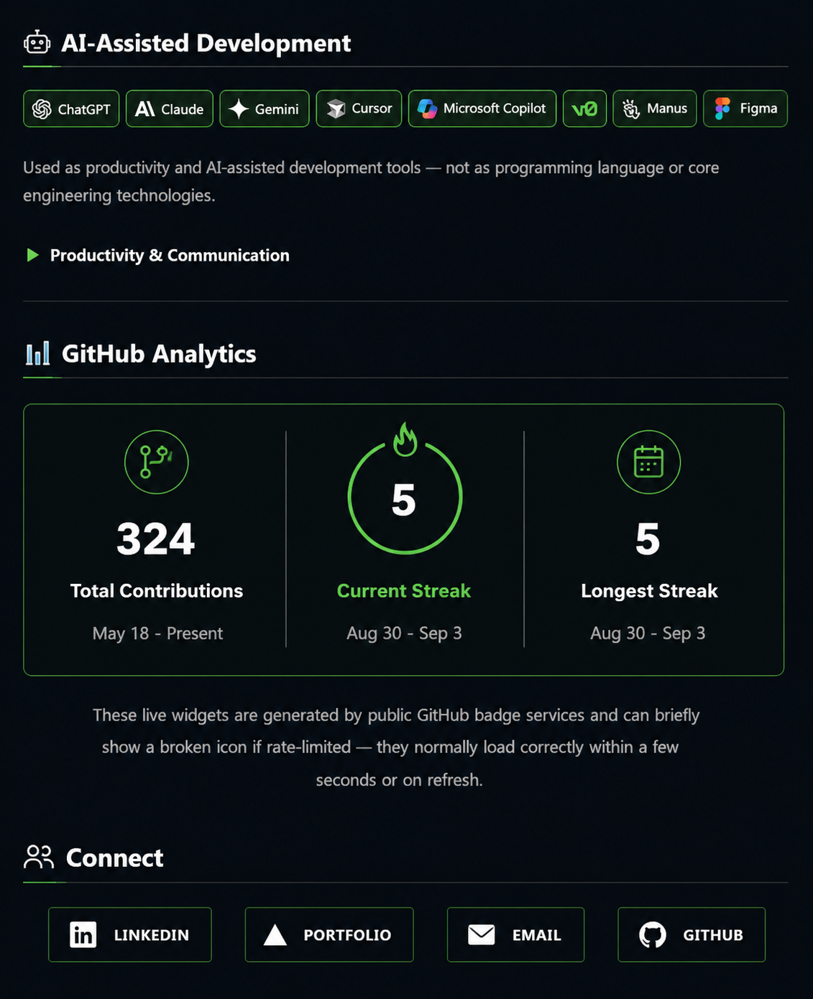

 

<a href="https://github.com/MuhammadAbdullahKhan11may/Eduvanta-full-scale-deployed-LMS"><b>View Eduvanta Repository →</b></a>

 

<a href="https://muhammadabdullahkhan11may.github.io/Portfolio-update-4-Cinematic/"><b>Live Portfolio →</b></a>
&nbsp;&nbsp;|&nbsp;&nbsp;
<a href="https://github.com/MuhammadAbdullahKhan11may/Portfolio-update-4-Cinematic"><b>Portfolio Source Code →</b></a>
&nbsp;&nbsp;|&nbsp;&nbsp;
<a href="https://github.com/MuhammadAbdullahKhan11may/Academic-IQ"><b>Academic IQ Repository →</b></a>

 

<a href="https://github.com/MuhammadAbdullahKhan11may/StreakFlow-_Apex_Algorithms"><b>StreakFlow Repository →</b></a>
&nbsp;&nbsp;|&nbsp;&nbsp;
<a href="https://github.com/MuhammadAbdullahKhan11may/Recipe-ingredient-Organizer"><b>Recipe Ingredient Organizer Repository →</b></a>

 

 

<a href="https://www.linkedin.com/in/muhammad-abdullah-khan-34b156402"><b>LinkedIn</b></a>
&nbsp;&nbsp;|&nbsp;&nbsp;
<a href="https://muhammadabdullahkhan11may.github.io/Portfolio-update-4-Cinematic/"><b>Portfolio</b></a>
&nbsp;&nbsp;|&nbsp;&nbsp;
<a href="mailto:abdullahkhan11may@gmail.com"><b>Email</b></a>
&nbsp;&nbsp;|&nbsp;&nbsp;
<a href="https://github.com/MuhammadAbdullahKhan11may"><b>GitHub</b></a>

